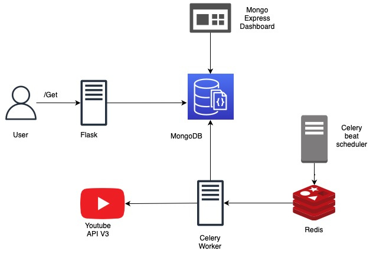

# FamPay Backend Intern Task 2023

### Postman docs -

[Fampay backend task](https://documenter.getpostman.com/view/11187828/2s8Z711sXW)

### Objective -

To build a system which fetches Youtube video data for a particular subject periodically in the background, and an API to retrieve it. 
Keeping in mind the performance, scalability and fault tolerance too.

### Tech Stack -

🌼 **Celery**

- Background job to fetch youtube videos periodically.

🥕 **********Redis**********

- Broker for celery

🌿 **************MongoDB**************

- The data we are storing is not very relational. 
We are also retrieving the whole document all at once, hence non-relational document storage seems right for this particular use case.

🚀 **********Flask**********

- Flask API to query the mongoDB for the youtube data

🐳 ****************************Docker / Docker compose****************************

- Containerised each service into separate containers, allowing us to scale individual service independently.

### Design diagram



### **Requirements**

✅ Background job to load youtube video data into mongoDB

✅ Implemented proper indexing

- Created indexes on videoId and publishTime.
- Hence good performance on the ranged queries using published_before, published_after dates.
- Text indexes on video title and description, hence faster filtering based on query through express dashboard.

✅ Background job to load youtube video data into mongoDB

- Celery beat to schedule periodic tasks.

✅ Scalable, optimised and fault tolerant

- Dockerized the whole system.
- Celery worker containers can be horizontally scaled to handle load.
- Also the Flask API service is horizontally scalable.
- In case if database goes down and comes back after sometime, the tasks will keep on resume adding videos from the last execution date, so that no data is lost.

### Bonus points

✅ Support for multiple API keys

- Use the API to add the keys, or you can manually add it through mongo express dashboard.

✅ Dashboard

- Mongo express container provides a dashboard to view all the collections.
- User can sort, query the videos fetched.
- Visit http://localhost:28081 to view the express dashboard.

### Instructions

Inside the repository, run these commands to launch the services

```bash
docker-compose build
docker-compose up
```

After all the containers are up,

use the postman collection to send the request to the **/add_api_key** api to add the youtube api key

```yaml
POST http://localhost:8000/add_api_key
Content-Type: application/json

{
    "key": "API_KEY_HERE"
}
```

Now the celery workers should start fetching the youtube videos.

### API

Use **/get** to retrieve the data in descending order of the published date

By default page of size 5 is returned, but you can specify the page size upto 50 items.

For ranged queries, use published_after and published_before params with dates in ISO format.

```bash
GET http://localhost:8000/get
```

```bash
# With addtional params
# page, limit, published_after, published_before
GET http://localhost:8000/get?page=5&limit=10&published_after=2023-01-03T04:24:53Z&published_before=2023-01-03T05:19:52Z
```